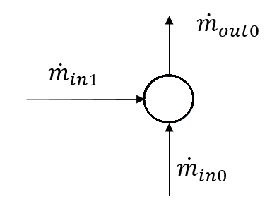
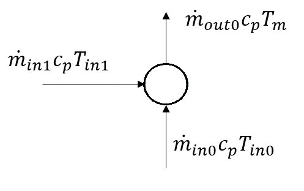

********
Junction
********

Create Function
===============

.. _create_junction:

.. autofunction:: pandapipes.create_junction

Component Table Data
====================

*net.junction*

.. tabularcolumns:: |p{0.12\linewidth}|p{0.10\linewidth}|p{0.25\linewidth}|p{0.30\linewidth}|
.. csv-table:: 
   :file: junction_par.csv
   :delim: ;
   :widths: 10, 10, 25, 40

*net.junction_geodata*

.. tabularcolumns:: |p{0.10\linewidth}|p{0.10\linewidth}|p{0.30\linewidth}|
.. csv-table:: 
   :file: junction_geo.csv
   :delim: ;
   :widths: 10, 10, 30
 
   
Physical Model
==============

The equations added by a junction correspond to a mass flow balance for hydraulic calculations.

.. math::
   :nowrap:

   \begin{align*}
    \sum_{n=0}^N \dot{m}_{in_n} - \sum_{n=0}^N \dot{m}_{out_n} = 0
   \end{align*}

For temperature calculations, the thermal power carried by the incoming fluids is balanced:

.. math::
   :nowrap:

   \begin{align*}
    \sum_{n=0}^N \dot{m}_{in_n}c_p T_{in_n} - \sum_{n=0}^N \dot{m}_{in_n} c_p T_{m} = 0
   \end{align*}

    

Result Table Data
=================

*net.res_junction*

.. tabularcolumns:: |p{0.10\linewidth}|p{0.10\linewidth}|p{0.40\linewidth}|
.. csv-table:: 
   :file: junction_res.csv
   :delim: ;
   :widths: 10, 10, 40
    

