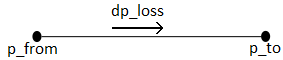

.. _pipe_component:

****
Pipe
****

Create Function
===============

.. _create_pipe:

.. autofunction:: pandapipes.create_pipe

Component Table Data
====================

*net.pipe*

.. tabularcolumns:: |p{0.15\linewidth}|p{0.10\linewidth}|p{0.25\linewidth}|p{0.40\linewidth}|
.. csv-table::
   :file: pipe_par.csv
   :delim: ;
   :widths: 15, 10, 25, 40

*net.pipe_geodata*

.. tabularcolumns:: |p{0.10\linewidth}|p{0.10\linewidth}|p{0.30\linewidth}|
.. csv-table::
   :file: pipe_geo.csv
   :delim: ;
   :widths: 10, 10, 30

Physical Model
==============

For both the hydraulic and temperature calculation mode, the main function of the pipe element is
to calculate pressure and heat losses, respectively.

Hydraulic mode
--------------

The following image shows the implemented pipe model with relevant quantities of the hydraulic
calculations:

Losses are calculated in different ways for incompressible and compressible media. Please also
note that for an incompressible fluid, the velocity along the pipe is constant. This is not the
case for compressible fluids.

Incompressible media
^^^^^^^^^^^^^^^^^^^^

The pressure loss for incompressible media is calculated according to the following formula:

.. math::
   :nowrap:

   \begin{align*}
    p_\text{loss} &= \rho \cdot g \cdot \Delta h - \frac{\rho \lambda(v) \cdot l v^2}{ 2 d} - \zeta \frac{\rho v^2}{2}  \\
   \end{align*}

Compressible media
^^^^^^^^^^^^^^^^^^

For compressible media, the density is expressed with respect to a reference state using the law of ideal gases:

.. math::
   :nowrap:

   \begin{align*}
    \rho &= \frac{\rho_N p T_N}{T p_N} \\
   \end{align*}

As reference state variables, the normal temperature and pressure are used by pandapipes. With this
relation, also the pipe velocity can be expressed using reference values:

.. math::
   :nowrap:

   \begin{align*}
    v &= \frac{T p_N}{p T_N}v_N \\
   \end{align*}

Inserting the equations from above in the differential equation for describing the pressure drop
along a pipe results in the following formula, which is used by pandapipes to calculate the
pressure drop for compressible media:

.. math::
   :nowrap:

   \begin{align*}
    \text{d}p_\text{loss} &= -\lambda(v) \frac{\rho_N v_N^2}{2 d}\cdot \frac{p_N}{p} \cdot \frac{T}{T_N} \cdot K \text{d}l  \\
   \end{align*}

The equation for pressure drop also introduces a variable K. This is the compressibility factor, which is used to
account for real gas behaviour.

After calculating the gas network, the pressure losses and velocities for the reference state are
known. During post processing, the reference velocities are recalculated according to

.. math::
   :nowrap:

   \begin{align*}
    v &= \frac{T p_N}{p T_N}v_N \\
   \end{align*}

The equations from above were implemented following :cite:`Eberhard1990`

Because the velocity of a compressible fluid changes along the pipe axis, it is possible to split a pipe into
several sections, increasing the internal resolution. The parameter *sections* is used to increase the amount of internal
pipe sections.

Friction models
^^^^^^^^^^^^^^^

Two friction models are used to calculate the velocity dependent friction factor:

- Nikuradse
- Prandtl-Colebrook

Nikuradse is chosen by default. In this case, the friction factor is calculated by:

.. math::
   :nowrap:

   \begin{align*}
    \lambda &= \frac{64}{Re} + \frac{1}{(-2 \cdot \log (\frac{k}{3.71 \cdot d}))^2}\\
   \end{align*}

Note that in literature, Nikuradse is known as a model for turbulent flows. In pandapipes, the formula for the
Nikuradse model is also applied for laminar flow.

If Prandtl-Colebrook is selected, the friction factor is calculated iteratively according to

.. math::
   :nowrap:

   \begin{align*}
     \frac{1}{\sqrt{\lambda}} &= -2 \cdot \log (\frac{2.51}{Re \cdot \sqrt{\lambda}} + \frac{k}{3.71 \cdot d})\\
   \end{align*}

Equations for pressure losses due to friction were taken from :cite:`Eberhard1990` and
:cite:`Cerbe.2008`.

Heat transfer mode
------------------

The following image shows the implemented pipe model with relevant quantities of the heat transfer
calculations:

For heat transfer, two effects are considered by the pipe element:

* The heat loss due to a temperature difference between the pipe medium
  and the surrounding temperature is calculated
* An additional heat in- or outflow can be specified by the user

The heat losses are described by

.. math::
   :nowrap:

   \begin{align*}
    Q_\text{loss} &= \alpha \cdot (T - T_\text{ext})\\
   \end{align*}

according to :cite:`Baehr2010`. If the default value of the sections parameter is changed, the
resolution of temperature values can be increased.

Result Table Data
=================

**For incompressible media:**

*net.res_pipe*

.. tabularcolumns:: |p{0.15\linewidth}|p{0.10\linewidth}|p{0.55\linewidth}|
.. csv-table::
   :file: pipe_res_liquid.csv
   :delim: ;
   :widths: 15, 10, 55

**For compressible media:**

*net.res_pipe*

.. tabularcolumns:: |p{0.15\linewidth}|p{0.10\linewidth}|p{0.55\linewidth}|
.. csv-table::
   :file: pipe_res_gas.csv
   :delim: ;
   :widths: 15, 10, 55
