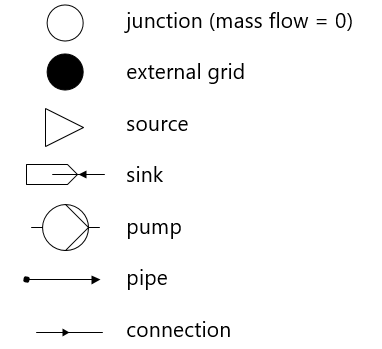

.. _networks:

########
Networks
########

In the following several example networks are listed. The networks were created in
STANET as well as in OpenModelica and converted to pandapipes. Each converted
network was saved in one json file. Calling the corresponding function loads the
results from the json file and saves them as pandapipes net. In the case of a
STANET net, you can usually choose between the friction models Nikuradse and
Prandtl-Colebrook. For OpenModelica only the results for Prandtl-Colebrook exist.

.. toctree::
    :maxdepth: 1

    networks/combined/combined_networks
    networks/meshed/meshed_networks
    networks/one_pipe/one_pipe_networks
    networks/strand/strand_networks
    networks/t_cross/t_cross_networks
    networks/two_eg/two_external_grids

Each network is accompanied by a picture, whereby the following description
of the components must be observed:

