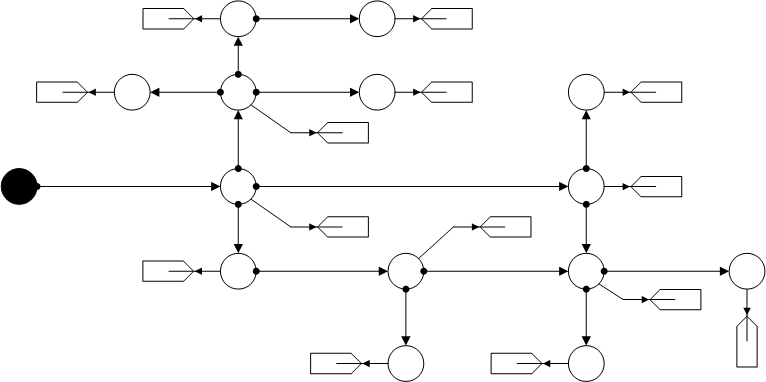
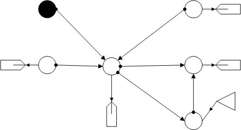
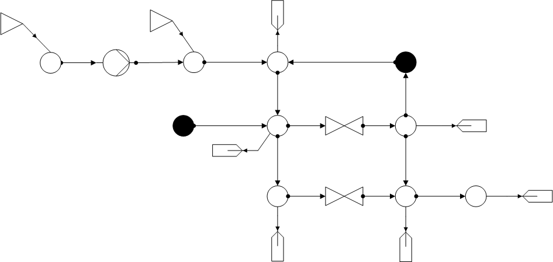
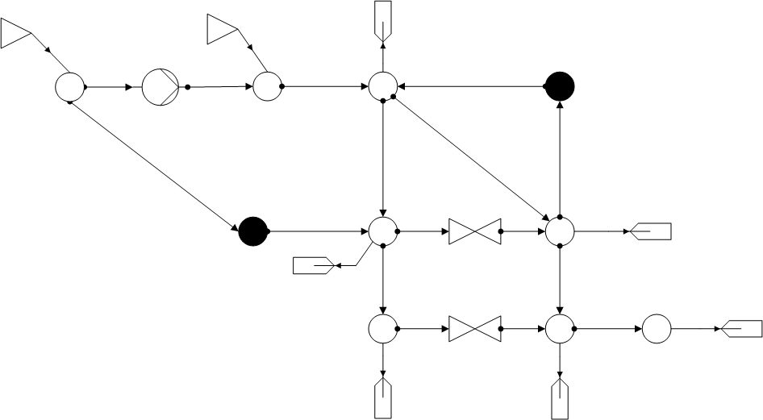
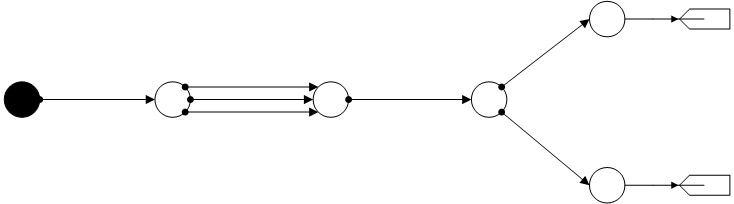

*****************
Combined Networks
*****************

This section lists the nets that contain mixed topologies,
namely combinations of meshes and strands.

District
========

Display of a small district with different height information and with water as fluid.

.. _water_district_grid:
.. autofunction:: pandapipes.networks.simple_water_networks.water_district_grid

Mixed Network
=============

Water network with a mesh in which one source appears.

.. _water_combined_mixed:
.. autofunction:: pandapipes.networks.simple_water_networks.water_combined_mixed

Versatility
===========

Network with one pump, two sources and two opened valves.

*Water:*

.. _water_combined_versatility:
.. autofunction:: pandapipes.networks.simple_water_networks.water_combined_versatility

*Gas:*

.. _gas_versatility:
.. autofunction:: pandapipes.networks.simple_gas_networks.gas_versatility

Parallel
========

Gas network with the characteristic of three parallel pipes between two junctions.

.. _gas_3parallel:
.. autofunction:: pandapipes.networks.simple_gas_networks.gas_3parallel
