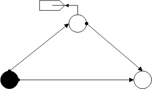
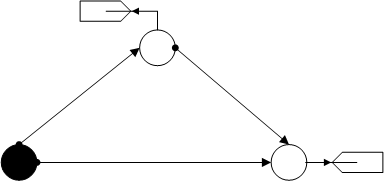
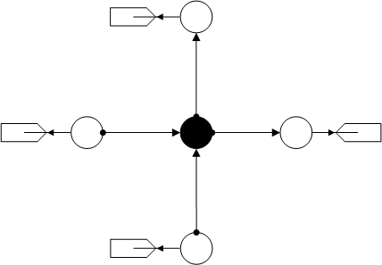
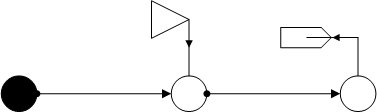
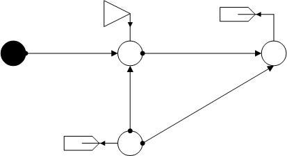
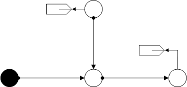
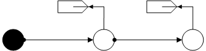

**********************
Heat Transfer Networks
**********************

This section lists the heat networks generated by OpenModelica.
The topologies are not differentiated, since OpenModelica can
only create thermal networks to a limited extent.
The individual pipes are mainly divided into 5 sections (sections = 5).

Delta
=====

Triangular network.

.. _heat_transfer_delta:
.. autofunction:: pandapipes.networks.simple_heat_transfer_networks.heat_transfer_delta

Delta with 2 Sinks
==================

Triangular network with two sinks.

.. _heat_transfer_delta_2sinks:
.. autofunction:: pandapipes.networks.simple_heat_transfer_networks.heat_transfer_delta_2sinks

Heights
=======

Cross-shaped net with height differences between the individual nodes. (sections = 7, for each pipe)

.. _heat_transfer_heights:
.. autofunction:: pandapipes.networks.simple_heat_transfer_networks.heat_transfer_heights

One Pipe
========

One pipe with a sink.

.. image:: one_pipe.png
	:width: 19em
	:alt: alternate Text
	:align: center

.. _heat_transfer_one_pipe:
.. autofunction:: pandapipes.networks.simple_heat_transfer_networks.heat_transfer_one_pipe

One Source
==========

Strand net with one source and one sink.

.. _heat_transfer_one_source:
.. autofunction:: pandapipes.networks.simple_heat_transfer_networks.heat_transfer_one_source

Section Variation
=================

Mesh network with different values for "sections" of the four pipes (4, 7, 10, 16).

.. _heat_transfer_section_variation:
.. autofunction:: pandapipes.networks.simple_heat_transfer_networks.heat_transfer_section_variation

T-Cross
=======

T-cross with two sinks.

.. _heat_transfer_t_cross:
.. autofunction:: pandapipes.networks.simple_heat_transfer_networks.heat_transfer_t_cross

Two Pipes
=========

Strand net with two sinks.

.. _heat_transfer_two_pipes:
.. autofunction:: pandapipes.networks.simple_heat_transfer_networks.heat_transfer_two_pipes
