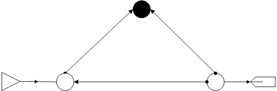
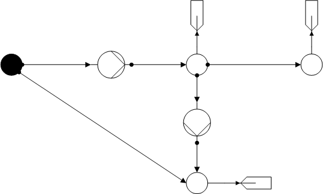
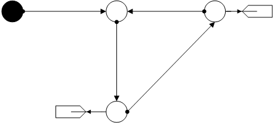
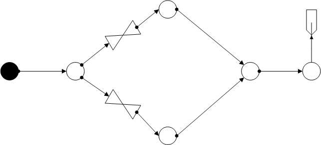
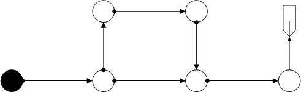

***************
Meshed Networks
***************

In Meshed Networks, all networks are grouped that have a purely meshed topology.

Delta
=====

One of the example nets to check the correctness of the signs in the calculation
of flow velocities. Regarding the STANET results, only Nikuradse is available
for the water case and Prandtl-Colebrook for the gas case.

*Water:*

.. _water_meshed_delta:
.. autofunction:: pandapipes.networks.simple_water_networks.water_meshed_delta

*Gas:*

.. _gas_meshed_delta:
.. autofunction:: pandapipes.networks.simple_gas_networks.gas_meshed_delta

Pumps
=====

Triangular net with 2 pumps and with differences in heights. Regarding the STANET results,
only Nikuradse is available for the water and gas case.

*Water:*

.. _water_meshed_pumps:
.. autofunction:: pandapipes.networks.simple_water_networks.water_meshed_pumps

*Gas:*

.. _gas_meshed_pumps:
.. autofunction:: pandapipes.networks.simple_gas_networks.gas_meshed_pumps

Heights
=======

Water network to determine the correct determination of height values from
OpenModelica to pandapipes.

.. _water_meshed_heights:
.. autofunction:: pandapipes.networks.simple_water_networks.water_meshed_heights

Two Valves
==========

A mesh with two opened valves has been placed in the net.

*Water:*

.. _water_meshed_2valves:
.. autofunction:: pandapipes.networks.simple_water_networks.water_meshed_2valves

*Gas:*

.. _gas_meshed_two_valves:
.. autofunction:: pandapipes.networks.simple_gas_networks.gas_meshed_two_valves

Square
======

Gas network with square arrangement of junctions and height informations.

.. _gas_meshed_square:
.. autofunction:: pandapipes.networks.simple_gas_networks.gas_meshed_square

