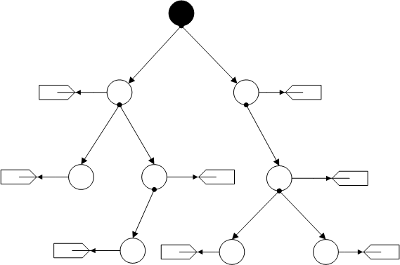
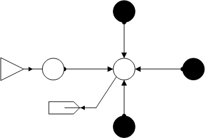
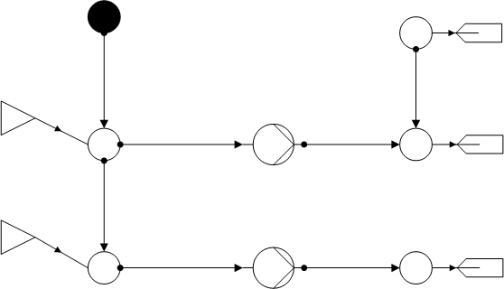
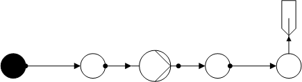

***************
Strand Networks
***************

This section contains only pure strand nets.

Simple Strand Net
=================

Water network with a tree topology.

.. autofunction:: pandapipes.networks.simple_water_networks.water_simple_strand_net

Two Pipes
=========

Two pipes connected by a junction.

.. image:: two_pipes.png
	:width: 40%
	:alt: alternate Text
	:align: center

*Water:*

.. autofunction:: pandapipes.networks.simple_water_networks.water_strand_2pipes

*Gas:*

.. autofunction:: pandapipes.networks.simple_gas_networks.gas_strand_2pipes

Cross
=====

Water network with one intersection and three external grids.

.. autofunction:: pandapipes.networks.simple_water_networks.water_strand_cross

Two Pumps
=========

Water network with two sources, two pumps, one external grid and three sinks.

.. autofunction:: pandapipes.networks.simple_water_networks.water_strand_net_2pumps

Pump
====

Network with one pump between two pipes. Regarding the STANET results,
only Nikuradse is available for the water and gas case.

*Water:*

.. autofunction:: pandapipes.networks.simple_water_networks.water_strand_pump

*Gas:*

.. autofunction:: pandapipes.networks.simple_gas_networks.gas_strand_pump
