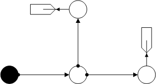
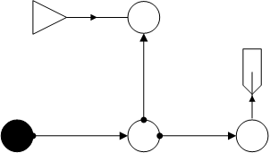
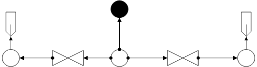

================
T-Cross Networks
================

The following examples are all constructed as a T-shaped networks.

T-Cross
-------

*Water:*

.. _water_tcross:
.. autofunction:: pandapipes.networks.simple_water_networks.water_tcross

*Gas:*

.. _gas_tcross1:
.. autofunction:: pandapipes.networks.simple_gas_networks.gas_tcross1

In the subsequent gas network a sink from the previous net has been replaced by a source.

.. _gas_tcross2:
.. autofunction:: pandapipes.networks.simple_gas_networks.gas_tcross2

Valves
------

Water network with two opened valves and two sinks.

.. _water_tcross_valves:
.. autofunction:: pandapipes.networks.simple_water_networks.water_tcross_valves

