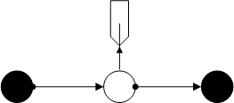
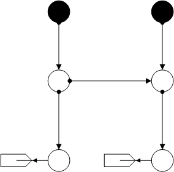

********************************
Networks with Two External Grids
********************************

This section contains only networks that have two external grids.

Two Pipes
=========

Water network with a sink, which connects the external grids by means of two pipes.

.. autofunction:: pandapipes.networks.simple_water_networks.water_2eg_two_pipes

H-Net
=====

An H-shaped gas net with two junctions and two sinks.

.. autofunction:: pandapipes.networks.simple_gas_networks.gas_2eg_hnet

