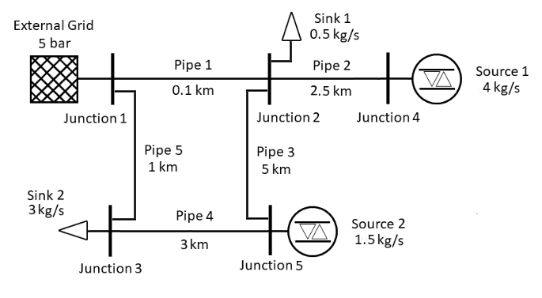
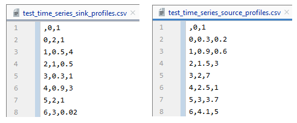

.. _example:

*******************
Time Series Example
*******************

Before a time series calculation can take place, a pandapipes network must be created.
This can be created by yourself as described in `Creating a Network <https://www.pandapipes.org/start/>`_
or loaded from the existing :ref:`networks` via ``pandapipes.networks.<network name/ path>``.
In this case the following simple water network is created:

::

    import pandapipes

    # create empty network
    net = pandapipes.create_empty_network("net", add_stdtypes=False)

    # create fluid
    pandapipes.create_fluid_from_lib(net, "water", overwrite=True)

    # diameter for the pipes
    d = 75e-3

    # create junctions
    j0 = pandapipes.create_junction(net, pn_bar=5, tfluid_k=293.15, name="Junction 1")
    j1 = pandapipes.create_junction(net, pn_bar=5, tfluid_k=293.15, name="Junction 2")
    j2 = pandapipes.create_junction(net, pn_bar=5, tfluid_k=293.15, name="Junction 3")
    j3 = pandapipes.create_junction(net, pn_bar=5, tfluid_k=293.15, name="Junction 4")
    j4 = pandapipes.create_junction(net, pn_bar=5, tfluid_k=293.15, name="Junction 5")

    # create external grid
    pandapipes.create_ext_grid(net, j0, p_bar=5, type="pt", t_k=293.15, name="External Grid")

    # create sinks
    pandapipes.create_sink(net, j1, mdot_kg_per_s=0.5, name="Sink 1")
    pandapipes.create_sink(net, j2, mdot_kg_per_s=3, name="Sink 2")

    # create sources
    pandapipes.create_source(net, j3, mdot_kg_per_s=4, name="Source 1")
    pandapipes.create_source(net, j4, mdot_kg_per_s=1.5, name="Source 2")

    # create pipes
    pandapipes.create_pipe_from_parameters(net, j0, j1, length_km=0.1, diameter_m=d, k_mm=0.1, name="Pipe 1")
    pandapipes.create_pipe_from_parameters(net, j1, j3, length_km=2.5, diameter_m=d, k_mm=0.2, name="Pipe 2")
    pandapipes.create_pipe_from_parameters(net, j1, j4, length_km=5, diameter_m=d, k_mm=0.05, name="Pipe 3")
    pandapipes.create_pipe_from_parameters(net, j4, j2, length_km=3, diameter_m=d, k_mm=0.3, name="Pipe 4")
    pandapipes.create_pipe_from_parameters(net, j0, j2, length_km=1, diameter_m=d, k_mm=0.35, name="Pipe 5")

Then the network must be prepared. Here the time series for the occurring
sinks and sources of the network must be given.
As in a steady-state calculation, the mass flows must be specified, whereby the
number of mass flows corresponds to the number T of time steps. The mass flows
for N sinks have to be written into a csv file as follows:

.. tabularcolumns:: |p{0.12\linewidth}|p{0.10\linewidth}|p{0.25\linewidth}|p{0.30\linewidth}|
.. csv-table::
   :file: timeseries_example_DataFrame_sink.csv
   :delim: ;

For this network, the structure of the csv files for the sinks and sources must look like this:

The corresponding csv file is afterwards read out and the resulting DataFrames are
then written into the network with the help of the controller
`ConstControl <https://pandapower.readthedocs.io/en/latest/control/controller.html#constcontrol>`_.
Now a variable ``time_steps`` can be defined, which contains integer steps
from 0 to T, in the example T is equal to 6. The prepared network and ``time_steps``
are needed to create an
`OutputWriter <https://pandapower.readthedocs.io/en/latest/timeseries/output_writer.html>`_ ``ow``.
This later contains the results of the time series simulation.
Finally, the main function for starting the simulation can be called.
``run_timeseries(net, time_steps, output_writer=ow)`` contains the
time loop in which the ``run_control`` function of pandapower is nested,
see :ref:`overview`.

In the following the code for the previous descriptions is listed:

::

    import os
    import pandas as pd
    import pandapower.control as control
    import pandapipes
    from pandapower.timeseries import DFData
    from pandapower.timeseries import OutputWriter
    from pandapipes.timeseries import run_timeseries
    from pandapipes import pp_dir

    # prepare grid
    profiles_sink = pd.read_csv(os.path.join(pp_dir, 'test', 'pipeflow_internals', 'data',
                                             'test_time_series_sink_profiles.csv'), index_col=0)
    profiles_source = pd.read_csv(os.path.join(pp_dir, 'test', 'pipeflow_internals', 'data',
                                               'test_time_series_source_profiles.csv'), index_col=0)
    ds_sink = DFData(profiles_sink)
    ds_source = DFData(profiles_source)

    const_sink = control.ConstControl(net, element='sink', variable='mdot_kg_per_s',
                                      element_index=net.sink.index.values, data_source=ds_sink,
                                      profile_name=net.sink.index.values.astype(str))
    const_source = control.ConstControl(net, element='source', variable='mdot_kg_per_s',
                                        element_index=net.source.index.values,
                                        data_source=ds_source,
                                        profile_name=net.source.index.values.astype(str))
    del const_sink.initial_powerflow
    const_sink.initial_pipeflow = False
    del const_source.initial_powerflow
    const_source.initial_pipeflow = False

    # define time steps
    time_steps = range(7)

    # create OutputWriter
    log_variables = [
        ('res_junction', 'p_bar'), ('res_pipe', 'v_mean_m_per_s'),
        ('res_pipe', 'reynolds'), ('res_pipe', 'lambda'),
        ('res_sink', 'mdot_kg_per_s'), ('res_source', 'mdot_kg_per_s'),
        ('res_ext_grid', 'mdot_kg_per_s')]
    ow = OutputWriter(net, time_steps, output_path=None, log_variables=log_variables)

    # run
    run_timeseries(net, time_steps, output_writer=ow)

Furthermore, the results of the simulation are accessible
via the ``OutputWriter ow`` and can be displayed with the ``print`` command:

::

    print(ow.np_results["res_junction.p_bar"])
    print(ow.np_results["res_pipe.v_mean_m_per_s"])
    print(ow.np_results["res_pipe.reynolds"])
    print(ow.np_results["res_pipe.lambda"])
    print(ow.np_results["res_sink.mdot_kg_per_s"])
    print(ow.np_results["res_source.mdot_kg_per_s"])
    print(ow.np_results["res_ext_grid.mdot_kg_per_s"])