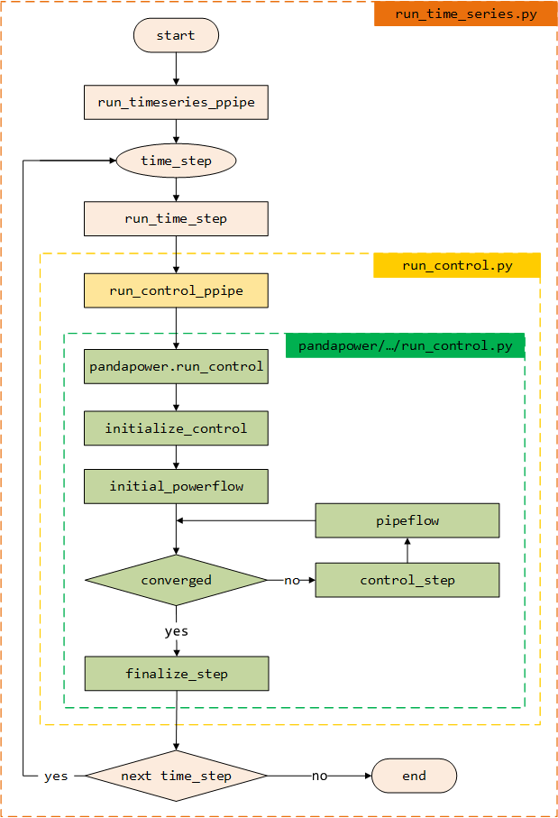

.. _overview:

***************************
Time Series Module Overview
***************************

In the following an overview of the sequence of function calls for the
time steps of the loop is shown. In this loop the pipeflow function is called
iteratively for each time step. The results are stored in an OutputWriter.
During this process, run_control.py by pandapower is accessed and the pipeflow
instead of the powerflow calculation is executed by the transfer parameters.
The green area thus corresponds to the same scheme as in
`Timeseries Module Overview <https://pandapower.readthedocs.io/en/v2.2.2/timeseries/timeseries_loop.html>`_
by pandapower.

